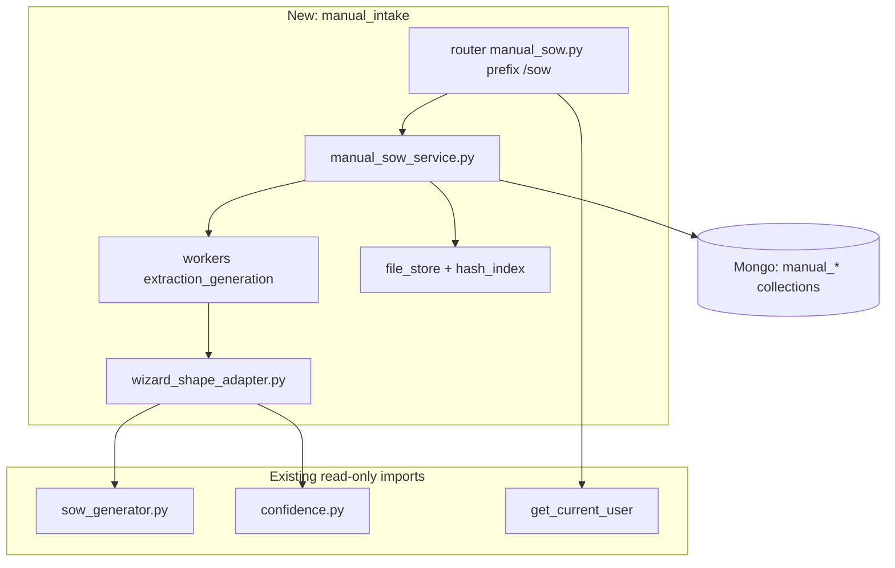

# Manual SOW Upload Flow — Implementation Plan

## Reality check vs your repo

| Topic | Current codebase | Spec v1.0 |
|--------|------------------|-----------|
| Layout | Backend lives under [`app/`](c:\Users\N7666\Downloads\GlimmoraTeam\app\) (rules mention `sow_backend/`; code is `app/`) | Same `/api/v1` prefix |
| DB | MongoDB + Motor ([`app/core/database.py`](c:\Users\N7666\Downloads\GlimmoraTeam\app\core\database.py)) | Relational tables in spec — **map to collections** (see §DB below) |
| Wizard SOW generation | [`generate_sow`](c:\Users\N7666\Downloads\GlimmoraTeam\app\services\wizard_service.py) builds `sow_doc` with `generated_content`, `quality_metrics`, `hallucination_layers` via [`generate_sow_content`](c:\Users\N7666\Downloads\GlimmoraTeam\app\services\sow_generator.py), `run_hallucination_checks`, `compute_risk_score`, `compute_confidence` | Async generation + preview + hallucination layers |
| LLM | **None wired** — [`sow_generator.py`](c:\Users\N7666\Downloads\GlimmoraTeam\app\services\sow_generator.py) is deterministic templates (“In production this would call an LLM”) | OCR/NLP extraction pipeline |
| Approvals | [`/approvals/{sow_id}/stage/{1-5}/decide`](c:\Users\N7666\Downloads\GlimmoraTeam\app\routers\approvals.py) updates `approvals` + `sows` by **ObjectId** | `/sow/{id}/approval-stage/{stageKey}/...` + snake_case JSON |

**“Don’t change existing project” (practical meaning):** Do not edit [`wizard.py`](c:\Users\N7666\Downloads\GlimmoraTeam\app\routers\wizard.py), [`wizard_service.py`](c:\Users\N7666\Downloads\GlimmoraTeam\app\services\wizard_service.py), [`sow.py`](c:\Users\N7666\Downloads\GlimmoraTeam\app\routers\sow.py), or [`approvals.py`](c:\Users\N7666\Downloads\GlimmoraTeam\app\routers\approvals.py). **Allowed minimal glue:** register a new router and indexes in [`main.py`](c:\Users\N7666\Downloads\GlimmoraTeam\app\main.py); add collection accessors (and optional settings) in [`database.py`](c:\Users\N7666\Downloads\GlimmoraTeam\app\core\database.py) / [`config.py`](c:\Users\N7666\Downloads\GlimmoraTeam\app\core\config.py). Everything else is **new packages/files**.

**Spec vs existing API contract:** The rest of the app uses `BaseResponse` and a different validation error shape ([`main.py`](c:\Users\N7666\Downloads\GlimmoraTeam\app\main.py) handler). The spec wants bare resources + `{ error, error_code, details }`. **Recommendation:** Implement the **manual intake router** with the spec’s response/error shapes (and optional `request_id`) so the new frontend contract is satisfied; document that `/wizards` and `/sows` remain unchanged. Alternatively, wrap manual routes in `BaseResponse` — only if product accepts one envelope for both flows.

---

## Architecture (additive)

- **IDs:** Store a UUID v4 string field `public_id` on each manual SOW document; keep Mongo `_id` as ObjectId internally if you prefer, but **expose only UUID** in JSON to match the spec.
- **Path:** `APIRouter(prefix="/sow", tags=["Manual SOW"])` so full paths are `/api/v1/sow/...` (no clash with existing `/sows`).

---

## Reusing the “AI SOW generator” logic (no edits to those files)

| Capability | Reuse | How |
|------------|-------|-----|
| Final SOW assembly text + section structure | **Yes** | Call `generate_sow_content(wizard_data)` after **`wizard_shape_adapter`** maps the 7 commercial sections + accepted/edited extraction items into `step_0`…`step_8` (same nested keys `section_a` etc. that [`sow_generator.py`](c:\Users\N7666\Downloads\GlimmoraTeam\app\services\sow_generator.py) already reads). |
| Hallucination layers (8 layers, pass/warn/fail semantics) | **Yes** | Call `run_hallucination_checks(wizard_data, steps_completed)` with `steps_completed` reflecting mandatory wizard steps you treat as satisfied by manual data (e.g. `[0,1,2,5,7,8]` plus optional steps you infer). Map UI/status: existing uses `status` like `"red"` → spec’s `failed`; `"green"` → `passed`, etc. |
| Risk score | **Yes** | `compute_risk_score(wizard_data)` |
| Overall confidence | **Yes** | `compute_confidence(wizard_data, steps_skipped=[])` or pass explicit skips for optional sections not collected |
| `wizard_service.generate_sow` end-to-end | **No (avoid)** | It requires a real `wizards` document and `validate_for_generation`; keep manual flow **out of** that path. |
| `/sows` and `/approvals` HTTP APIs | **No** | Different URLs, payloads, and `sows` schema; manual pipeline implements spec endpoints in the new router only. |

**Document extraction / OCR / clause segmentation:** Not present today. Implement a **new** `app/services/manual_extraction/` (or similar) with:

- **Phase 1 (dev):** Deterministic stub: parse PDF text (e.g. `pypdf`) / DOCX (`python-docx`), fake categories + confidence, still runs the same progression gates.
- **Phase 2 (prod):** Pluggable provider (OpenAI/Anthropic/AWS Textract) behind an interface; secrets via [`config.py`](c:\Users\N7666\Downloads\GlimmoraTeam\app\core\config.py) / env.

That reuses **downstream** generation/scoring only; **upstream** extraction is new work.

---

## MongoDB collections (mirror spec §17, one doc vs embedded)

Keep **one primary document** per manual SOW with embedded subdocuments where practical to avoid 15 round-trips; add separate collections only when you need heavy indexing or large arrays.

Suggested collections:

- `manual_sows` — core record: status, intake_mode, title, client, version, timestamps, `created_by_user_id`, `enterprise_id` (if you use it), file metadata, `processing_state`, `upload_progress`, `approval_stages` snapshot, `approval_authorities`, `hallucination_flags`, scores, `commercial_details` (7 sections + per-section status), `generation_job`, `change_requests[]`, `audit` pointers.
- `manual_sow_files` — `public_id`, `sow_public_id`, storage key, `hash_sha256`, `mime`, `size`, `uploaded_at` (supports UPL-005 queries by user + hash + time window).
- `manual_sow_extraction_items` — index `(sow_public_id, category, review_state)`.
- `manual_sow_gap_items` — index `(sow_public_id, severity, is_resolved)`.
- `manual_sow_sections` / `manual_sow_clauses` — post-generation display (or embed in `manual_sows` if volume is low).
- `manual_sow_approval_messages` — thread messages.
- `manual_sow_generation_jobs` / `manual_sow_extraction_jobs` — async job state for polling.
- Optional: `manual_sow_audit_log` for §19.

Add indexes in **`create_indexes()`** in [`main.py`](c:\Users\N7666\Downloads\GlimmoraTeam\app\main.py) (additive block) matching list filters: `status`, `created_by_user_id`, `created_at`, `hash_sha256` + `created_by_user_id` + `uploaded_at` for duplicate detection.

---

## Endpoint implementation grouping (map to spec sections)

Implement in **one router file** or split by step (`upload.py`, `commercial.py`, …) under e.g. `app/routers/manual_sow/` — all included with `prefix="/sow"`.

1. **Upload (§4):** `POST /upload` (multipart), `GET /{sowId}/upload-status`. Validate UPL-001–009; stream file to object storage or local path behind an interface; enqueue extraction job; return **200** as spec (or align with global style if you adopt 201).
2. **Extraction report (§5):** `GET /{sowId}/extraction-report` — 409 until job `complete`.
3. **Extraction items (§6):** list, PATCH review-state, POST accept-all; enforce **≥1 `features` accepted/edited** before gap analysis unlock (service-level check).
4. **Gaps (§7):** GET, PATCH with severity rules (critical/important/optional).
5. **Commercial (§8):** GET aggregate, PATCH per section, POST validate, POST mark-complete, PATCH approval-authorities.
6. **Generation (§9):** POST `generate` → **202** + job id; GET `generation-status`. Inside worker: build `wizard_data` → `generate_sow_content` + hallucination + risk + confidence → persist `sections`, layers, `preview_text`, timestamps for stale check (7 days).
7. **Preview / submit (§10):** GET `preview` (hard blocks: stale, any layer `failed`); POST `confirm-and-submit` initializes **5 stages** in embedded array or companion collection; status → `approval`.
8. **Approvals (§11):** Implement **spec routes** (`approval-stages`, `approve`, `reject`, `approval-messages`, `mark-read`) against **manual** collections only; enforce reviewer == designated authority (403). **Do not** call existing [`approvals.py`](c:\Users\N7666\Downloads\GlimmoraTeam\app\routers\approvals.py) unless you later add an explicit “unified approvals” project (out of scope for strict additive).
9. **CRUD (§12):** list with pagination/sort; GET full; PATCH metadata; DELETE only if `draft` → set `archived` or `deleted_at` per spec soft-delete.
10. **Sections / clauses / hallucination-layers (§12):** read from persisted generation output; map layer names/count to spec (spec shows 8 layers with example names — align mapping table in code comments).
11. **Export (§13):** PDF/DOCX/JSON — use libraries (WeasyPrint / python-docx) in new `manual_export_service`; 422 if not generated.
12. **NDA (§13):** `GET /nda-document`, `GET /nda-download` — can live on same router with **no auth** as spec; serve static template or generated PDF (new assets under `app/static/` or templates).

---

## Auth, authorization, security (§19 + your [`get_current_user`](c:\Users\N7666\Downloads\GlimmoraTeam\app\core\security.py))

- All `/sow/*` except NDA: `Depends(get_current_user)`.
- Access: creator **or** user listed in `approval_authorities` for **read**; stage reviewer for **approve/reject**; optional enterprise scoping if `enterprise_id` exists on user.
- Rate limiting: middleware or dependency (10 uploads/min, 60 req/min) — **new**, e.g. Redis sliding window.
- File: AV scan hook (ClamAV or cloud) before marking upload accepted; password-protected PDF detection; size cap 50MB.
- Storage: no raw paths in API; signed URLs internally.

---

## Async execution (§1, §4, §9, §18)

- **Do not** block request handlers on OCR/generation.
- Use **Celery + Redis**, **ARQ**, or **FastAPI BackgroundTasks** for MVP (single-node) → move to queue for production.
- Job documents store `processing_state`, `progress_percent`, `current_stage_label`, errors (`scanned_pdf_detected`, etc.).

---

## Validation & state machine (§14–16)

- Implement Pydantic v2 models per §3–3.8 and §14.2 in `app/schemas/manual_sow/` (all **new** files).
- Central **state service** functions: `assert_can_advance_step_3_to_4`, etc., called by PATCH/POST handlers to avoid drift.
- Align **SowStatus** transitions with §16.1 in code (enum separate from [`SOWStatus`](c:\Users\N7666\Downloads\GlimmoraTeam\app\schemas\common.py) to avoid breaking wizard semantics).

---

## Testing & rollout

- New tests under `tests/test_manual_sow/` with pytest-asyncio: upload validation, gate rules, approval 403, stale document block, duplicate hash.
- `.env.example`: add object storage, queue URL, optional `OPENAI_API_KEY`, AV mode, rate limit toggles.

---

## Implementation order (recommended)

1. **Scaffold:** `database` accessors, empty router + `include_router`, indexes, config placeholders.
2. **Models + error helper** matching spec JSON (snake_case in Python with `Field(alias=...)` if you want camelCase in JSON).
3. **Upload + file store + hash duplicate + job skeleton** (stub extraction → `complete`).
4. **Extraction items + report** (stub data first).
5. **Gaps** (rule engine vs static library).
6. **Commercial sections + validators** (§14.2).
7. **Adapter + call** `generate_sow_content` / `run_hallucination_checks` / `compute_risk_score` / `compute_confidence` in generation worker.
8. **Preview + confirm-and-submit + full approval pipeline** + messages.
9. **List/get/patch/delete + sections/clauses/layers + exports + NDA**.
10. **Harden:** rate limits, audit log, real OCR/LLM provider, PDF/DOCX quality, monitoring.

This yields a **clean separation**: wizard-based AI flow unchanged; manual flow is a **second product surface** on the same FastAPI app, reusing **deterministic generation/scoring** from existing services and adding **new** extraction, storage, and approval HTTP surface per the spec.
